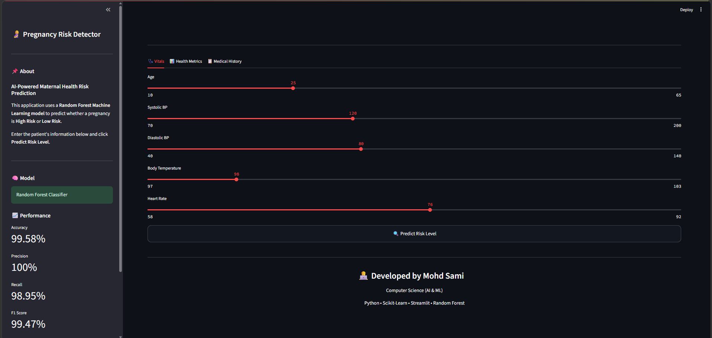
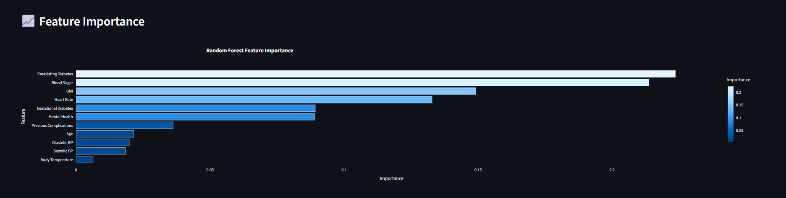

# 🤰 Pregnancy Risk Detector using Machine Learning


An end-to-end Machine Learning application that predicts whether a pregnancy is **High Risk** or **Low Risk** using maternal health indicators. The project covers the complete machine learning workflow—from exploratory data analysis and preprocessing to model training, evaluation, and deployment with Streamlit.

---

# 📌 Project Overview

Pregnancy complications are a major healthcare concern. Early identification of high-risk pregnancies allows healthcare professionals to provide timely interventions and improve maternal and fetal outcomes.

This project uses supervised machine learning to classify pregnancy risk based on patient health parameters such as:

- Age
- Blood Pressure
- Blood Sugar
- BMI
- Body Temperature
- Heart Rate
- Previous Pregnancy Complications
- Diabetes History
- Mental Health Status

The trained Random Forest model is deployed using **Streamlit**, allowing users to enter patient information through an interactive web application and instantly receive a prediction.

---

# 🚀 Live Demo

**Streamlit App**

```
https://pregnancy-risk-detection.streamlit.app/
```

---

# 📷 Application Screenshots

## Home Page



---

## Prediction Result
### Demo

https://github.com/user-attachments/assets/23cd087a-54a8-4e45-bfe2-e4694880fec0

---

https://github.com/user-attachments/assets/b5dca398-674b-48e4-a6c1-c2d63a9be822

---

## Feature Importance



---

# ✨ Features

- Interactive Streamlit web application
- User-friendly interface
- Patient information grouped into tabs
- Automatic preprocessing
- Missing value handling
- Feature scaling
- Random Forest prediction
- Prediction confidence score
- Clinical interpretation
- Feature importance visualization
- Model performance dashboard

---

# 🛠 Tech Stack

### Programming Language

- Python

### Libraries

- Pandas
- NumPy
- Matplotlib
- Seaborn
- Scikit-Learn
- Imbalanced-Learn (SMOTE)
- XGBoost
- Plotly
- Streamlit
- Pickle

---

# 📂 Dataset

The dataset contains maternal health information collected from pregnant patients.

## Target Variable

```
Risk Level

• High
• Low
```

## Features

| Feature | Description |
|----------|-------------|
| Age | Mother's age |
| Systolic BP | Systolic Blood Pressure |
| Diastolic | Diastolic Blood Pressure |
| BS | Blood Sugar |
| Body Temp | Body Temperature |
| BMI | Body Mass Index |
| Previous Complications | Previous pregnancy complications |
| Preexisting Diabetes | Existing diabetes before pregnancy |
| Gestational Diabetes | Diabetes developed during pregnancy |
| Mental Health | Mental health condition |
| Heart Rate | Heart rate |

---

# 📊 Exploratory Data Analysis

The dataset was explored before model training to understand its quality and characteristics.

EDA included:

- Dataset overview
- Missing value analysis
- Statistical summary
- Target variable distribution
- Feature distributions
- Correlation analysis
- Outlier detection
- Class imbalance analysis

---

# ⚙ Data Preprocessing

The preprocessing pipeline included:

- Missing value imputation using **Median**
- Feature Scaling using **StandardScaler**
- Train-Test Split (80:20)
- Class balancing using **SMOTE**

---

# 🤖 Machine Learning Models

The following models were trained and evaluated:

- Logistic Regression
- Decision Tree
- Random Forest
- XGBoost

After comparison, **Random Forest** achieved the best overall performance and was selected as the final model.

---

# 🔧 Hyperparameter Tuning

Random Forest was optimized using **GridSearchCV**.

Parameters tuned included:

- Number of Trees
- Maximum Depth
- Minimum Samples Split
- Minimum Samples Leaf

Best Parameters:

```python
{
    "n_estimators":100,
    "max_depth":None,
    "min_samples_split":2,
    "min_samples_leaf":1
}
```

---

# 📈 Model Performance

| Metric | Score |
|---------|-------|
| Accuracy | 99.58% |
| Precision | 100% |
| Recall | 98.95% |
| F1 Score | 99.47% |

---

# 📉 Feature Importance

The Random Forest model identified the following features as the most influential:

1. Preexisting Diabetes
2. Blood Sugar
3. BMI
4. Heart Rate
5. Gestational Diabetes

Feature importance is displayed within the Streamlit application using an interactive Plotly chart.

---

# 📁 Project Structure

```text
pregnancy-risk-detector/

│ 
├── app.py
├── requirements.txt
├── README.md
├── .gitignore
│
├── assets/
│   ├── style.css
│   ├── screen_shots.png
│ 
├── models/
│   ├── pregnancy_risk_detector.pkl
│   ├── scaler.pkl
│   └── imputer.pkl
│
└── data/
    ├── pregrisk_dataset.csv
```

---

# 💻 Installation

Clone the repository

```bash
git clone https://github.com/Sami21234/pregnancy-risk-detection
```

Move into the project

```bash
cd pregnancy-risk-detection
```

Install dependencies

```bash
pip install -r requirements.txt
```

Run the application

```bash
streamlit run app.py
```

---

# 🔮 Future Improvements

- Multi-class pregnancy risk prediction
- SHAP explainability
- Doctor dashboard
- Patient history management
- PDF report generation
- Cloud database integration
- Docker deployment
- CI/CD pipeline

---

# 👨‍💻 Author

**Mohd Sami**

Computer Science Engineering (AI & ML)

GitHub: https://github.com/Sami21234

LinkedIn: https://www.linkedin.com/in/mohd-sami-dev

---

# 📄 License

This project is licensed under the MIT License.
